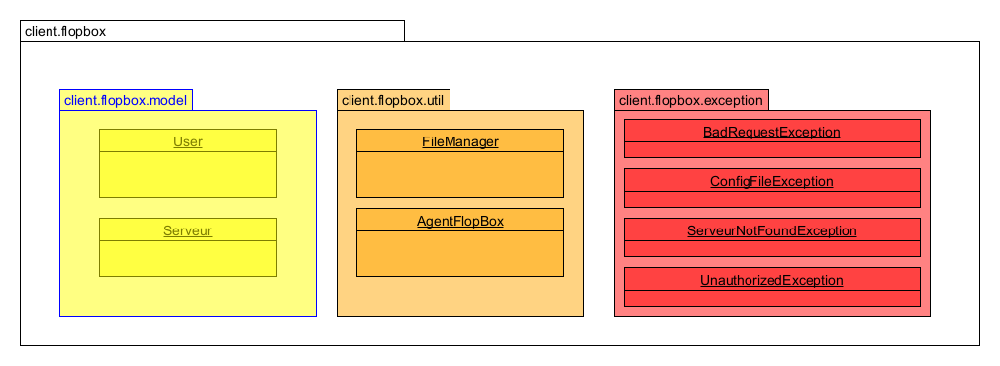

# Agent FlopBox

Développer une application cliente pour la plate-forme FlopBox qui permette de synchroniser les données stockées à distance dans un ensemble de serveurs FTP avec le système de fichiers local d'une machine sur laquelle l'application cliente sera exécutée.

Hatim  M'RABET EL KHOMSSI, Nouria Aitkheddache

14/04/2022

## Introduction

Ce projet permet de synchroniser les données stockées à distance sur une multitude de serveurs FTP avec le système de fichier local d'une machine sur laquelle l'application cliente sera exécutée.

L'application va se connecter à la plateforme FlopBox , récupérer la liste des alias puis créer un répertoire pour chaque serveur et y stocker tous les fichiers du serveur FTP pour lesquels l'utilisateur a accès.

L'application va veuiller sur l'envoie et la reception des fichiers pour que le repertoire de synchronisation soit toujours à jour.

Pour cette application, on a utilisé l'API FlopBox développé par Hatim M'RABET lors du projet precedent avec quelques modifications. L'API est telechargeable sur l'adresse suivante : [Gitlab](https://gitlab.univ-lille.fr/hatim.mrabetelkhomssi.etu/sr2-hatim-mrabet/-/tree/V4).

Lors de l'utilisation du client, il faut activer le vpn, lancer le serveur API, et modifier les donneés de connection du client.

## Architecture du rendu

Le rendu est composé de :
* Un dossier **src** qui contient le projet Maven.
* Un dossier **doc** qui contient la vidéos de démonstration du projet.
* Un dossier **target** qui contiendra la documentation javadoc et l'exécutable jar.
* Un fichier **config.json** le fichier de configuration qui continet les données d'authentification pour l'api flopbox et les serveurs FTP, ainsi que le chemin vers le dossier de synchronisaton.
* un dossier **docs** qui contient la video de demonstration.

### la gestion d'erreur;

En se basant sur la reponse de l'API FlopBox, on peut gérer les erreurs en utilisant la fonction suivante :

```java
    private static void checkHttpResponseCode(HttpResponse response, HttpEntity entity) throws ParseException, IOException {
        int responseCode = response.getStatusLine().getStatusCode();
        if (responseCode == 400)
            throw new BadRequestException("BadRequestException : " + EntityUtils.toString(entity, "UTF-8"));
        if (responseCode == 401)
            throw new UnauthorizedException("UnauthorizedException : " + EntityUtils.toString(entity, "UTF-8"));
        if (responseCode == 404)
            throw new ServeurNotFoundException("ServeurNotFoundException : " + EntityUtils.toString(entity, "UTF-8"));
    }
```
Les trois exceptions plus que ConfigFileExceptio sont disponible dans le package `exception`.
## Utilisation

### Etape 1: récupérer le projet

L'API FlopBox est disponible sur : [Gitlab FlopBox](https://gitlab.univ-lille.fr/hatim.mrabetelkhomssi.etu/sr2-hatim-mrabet/-/tree/V4).

Le Client FlopBox est disponible sur : [Gitlab Client](https://gitlab.univ-lille.fr/hatim.mrabetelkhomssi.etu/sr2-mrabet-aitkheddach-clientflopbox).

### Etape 2: exécuter le projet

Compilation du projet:
```shell
mvn clean compile assembly:single
mvn javadoc:javadoc
```
Exécution du projet:
```shell
	java -jar .\target\client-flopbox-3.0-jar-with-dependencies.jar
```
## Les classes 

Voici le diagramme UML des classes du projet :



### Model

- User: qui représente un utilisateur avec son username, mot de passe, le fichier racine, et sa liste de serveurs.
- Serveur: qui représente un serveur FTP avec son alias, username, mot de passe et fichier racine.
  
### Util

FileManager qui gere tout les manipulations des fichiers en local, et contient :
* la méthode initRacine() qui permet de créer le dossier racine local 
* la méthode initServeurs() pour chaque serveur creer un dossier et il y a tout se qui est manipulation du fichier(supprimer , ziper inzip, infos de chaque fichier/ dossier (date de modification)).

AgentFlopBox contient tous les methodes necessaires pour la synchronisation des fichiers:
* Telecharger, Uploader un fichier ou un dossier en utilisant l'API FlopBox. 
* Synchronisation : qui gere la synchronisation en envoiant des requetes HTTP.

## Code Samples

La Méthode qui permet de synchroniser serveur<->local.

```java
public static void synchronisation() throws ClientProtocolException, IOException, java.text.ParseException
    {
        User u = User.getInstance();
        for(Serveur s : u.getServeurs().values())
        {
            System.out.println("Synchronisation du serveur " + s.getAlias());
            JsonObject remote = AgentFlopBox.infoRemoteFiles(s,"").getAsJsonObject();
            JsonObject local = FileManager.infoLocalFiles(s.getRacine().getAbsolutePath()).getAsJsonObject();
            compareFiles(s, local, remote);
        }
    }
``` 

Pour comparer les fichiers du local et remote, on a la fonction compareFiles.

```java
    public static void compareFiles(Serveur s, JsonObject localJson, JsonObject remoteJson) ... {
        compareWithLocalFiles(s, localJson, remoteJson);
        compareWithRemoteFiles(s, localJson, remoteJson);
    }

    public static void compareWithLocalFiles(Serveur s, JsonObject localJson, JsonObject remoteJson) ...
    {
        ...
        // parcourir les fichiers locaux
        for (Map.Entry<String, JsonElement> entry : localJson.entrySet()) {
            // si le fichier n'existe pas sur le serveur on l'upload
            // sinon on compare la date du dernier modification, pour telecharger ou uploader
            ...
        }

    }

    public static void compareWithRemoteFiles(Serveur s, JsonObject localJson, JsonObject remoteJson){
        // on compare le remote avec le locale
        for (Map.Entry<String, JsonElement> entry : remoteJson.entrySet()) {
            // fichier existe dans le remote mais pas en local et non pas dans le dossier , on telecharge
            ...
            // si le fichier existe en remote mais pas en local et sa date de modification est ancienne que la date du derniere synchronisation, on le supprime du serveur (on l'envoie vers le fichier "deleted")
            ...
            else if (localJson.has(entry.getKey())) // le fichier existe en local aussi
            {
                if (type.equals("directory")) {
                    // on compare leurs contenus
                    compareFiles(s, localObj.get("content").getAsJsonObject(), remoteObj.get("content").getAsJsonObject());
                    ...
                }
        ...
    }
```

Puisque on a qu'un seul utilisateur, on utiliser Singleton sur la class User qui est initialisé à partir du fichier config.json.

```java
    private User() {
        JsonObject data = FileManager.getJsonFileContent();
        this.username = data.get("username").getAsString();
        this.password = data.get("password").getAsString();
        this.token = Base64.getEncoder().encodeToString((username + ":" + password).getBytes());
        this.racine = new File(data.get("localPath").getAsString());
        this.serveurs = new HashMap<>();
        JsonObject sers = data.get("serveurs").getAsJsonObject();
        for (String key : sers.keySet()) {
            JsonObject obj = sers.getAsJsonObject(key);
            Serveur s = new Serveur(key, obj.get("username").getAsString(), obj.get("password").getAsString());
            this.serveurs.put(key, s);
        }
    }

    public static User getInstance() {
        if (instance == null) instance = new User();
        return instance;
    }
```